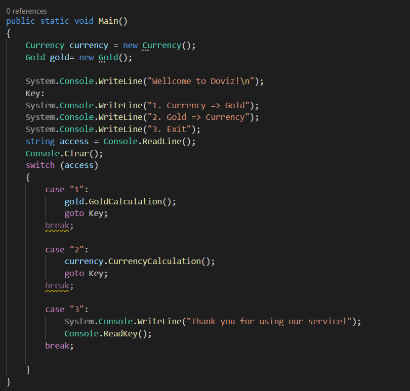
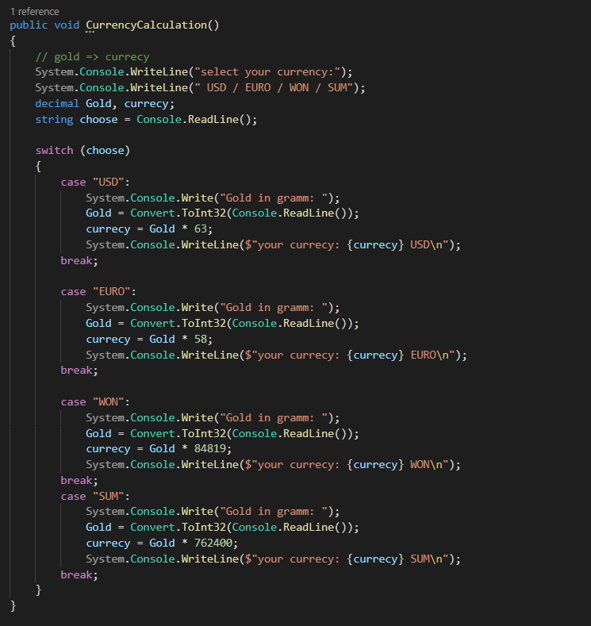
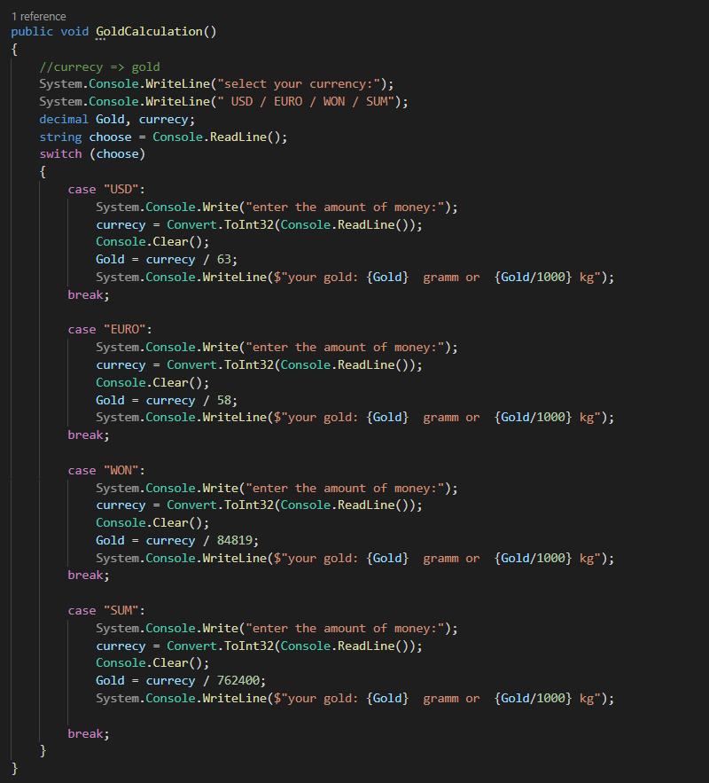

# DOVIZ.CLONE
this program represents a simple currency converter program that allows the user to convert between gold and different currencies.


***
Here is the code breakdown and how it works:

+ The code starts with the Currency namespace, which contains the ```Program``` class responsible for running the program.

+ An instance of the Currency and Gold classes is created in the Main method of the Program class.

+ The program then displays a menu with three options: ```"Currency => Gold"```, ```"Gold => Currency"``` and "Exit".

+ The user's selection is retrieved via ```Console.ReadLine()``` and stored in an input variable.

+ Based on the user's selection, the program uses the switch statement to perform the appropriate action.

+ If the user selects the option ```"Currency => Gold"``` (input value "1"), it calls the ```gold.GoldCalculation()``` method from the Gold class.

+ If the user selects the ```"Exit"``` option (input value is "3"), the program displays a thank you message and exits.



***
The ```Currency``` class contains the ```CurrencyCalculation()``` method, which prompts the user to enter the amount of currency and gold, performs the conversion, and displays the converted amount of the currency.



***

The ```Gold``` class contains the ```GoldCalculation()``` method, which prompts the user to enter a currency and amount, performs the conversion, and displays the converted amount of gold.



***
# RESULT:

.gif)

[My GitHub](https://github.com/Axliddinjon)